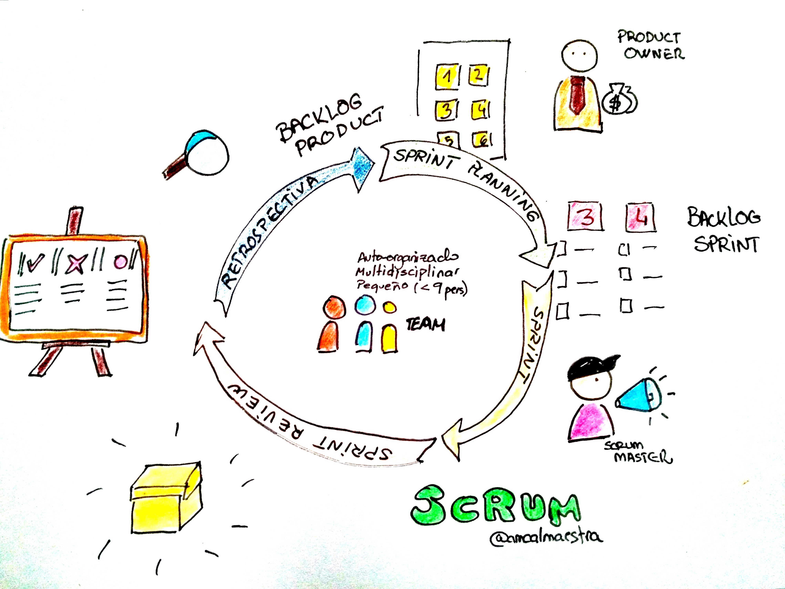

# Metodología Scrum

El *Scrum* es un proceso de trabajo en equipo utilizado mayoritariamente en empresas para obtener el mejor resultado en un proyecto caracterizado por su uso en entornos complejos donde la innovación, la competitividad, la flexibilidad y la productividad son fundamentales. Dentro de esta metodología intervienen el dueño del producto (*Product Owner*), el grupo encargado del *Scrum*, el *Scrum Master* y los revisores de este. Mediante esta metodología un proyecto está dividido en ciclos temporales breves y fijos (sprints de 2 a 4 semanas). Cada uno de estos ciclos debe proporcionar un resultado completo para que el producto final sea entregado al cliente con el mínimoesfuerzo.

Se podría decir que el *Scrum* se divide en tres partes; la ***Sprint Planning***, la cual se divide en dos partes, la selección de requisitos (el cliente presenta al equipo la lista de requisitos con prioridad para el proyecto y se resuelven las dudas) y el ***Sprint review*** donde el equipo elabora la lista de tareas de la iteración que son necesarias para los requisitos, para esto el equipo se autoorganiza y autoasigna tareas para así resolverlas más eficientemente **la ejecución de la iteración**, donde se realiza una reunión de inspección y sincronización del trabajo de cada integrante del equipo y se produce un enfoque en el desarrollo de las tareas; y la **inspección y adaptación**, que se divide en dos partes: la revisión, donde el equipo presenta al cliente los requisitos completados en la iteración para que sean revisados y  adaptados si es necesario; y por último la **retrospectiva**, donde el equipo analiza su manera de trabajar y localiza sus errores para tener en cuenta su mejora y eficiencia.

| Ventajas       |Desventajas   | 
|--------------|-----------|
| Es una metodología que asegura la mayor optimización posible de tiempo | Es una metodología que en caso de cualquier desorden por parte del equipo puede llegar a complicar el desarroyo     |
| En caso de cambios de idea por parte del cliente en respecto al proyecto esta metodología ofrece la forma de adaptarse a esos cambios sin tener que revertir ningún proceso de la metodología     |Existe la posibilidad de que el   cliente rechace el proyecto en base a los prototipos

